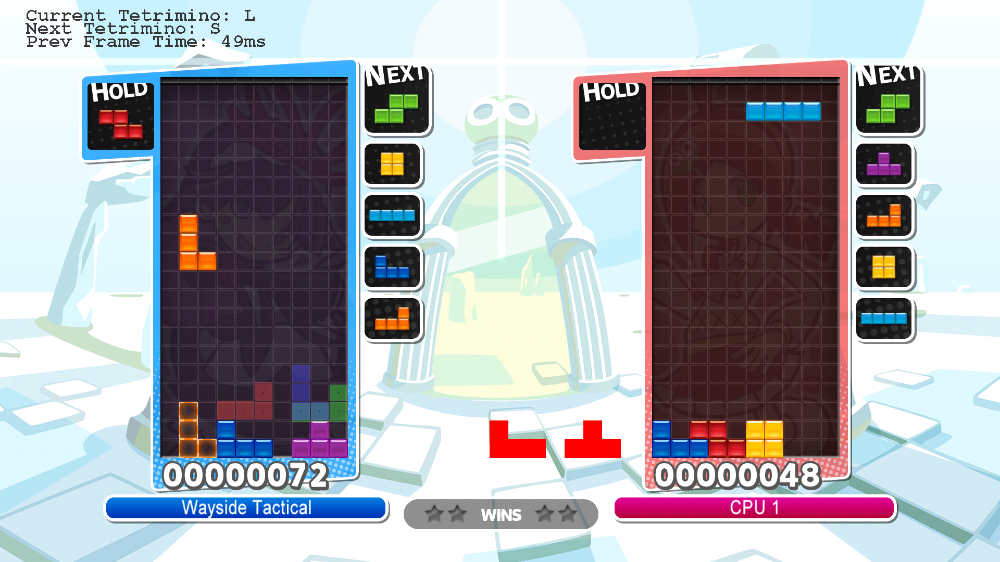

# T-Spin-Tutor  
Aids players in setting up T-Spins in Puyo Puyo Tetris, using real-time screen analysis and a transparent overlay.  
Requires Java to run (1.8 or later is recommended, but earlier versions should still work)  
  
## Preview:  
  